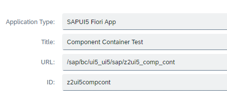

# ABAP2UI5 Component Container demo
This demo app is a classical Fiori Element list report. Inside the object page extension (facet) we placed an component container which calls the ABAP2UI5 app via the FLP frontend (z2ui5).
The context data of the list report are forwarded to the ABAP2UI5 app via startup parameters.

## Setup FLP Target Mapping
 

## Run application and press "Go" button

## Select one of the table lines

## The bottom facet shows the content of the ABAP2UI5 app

